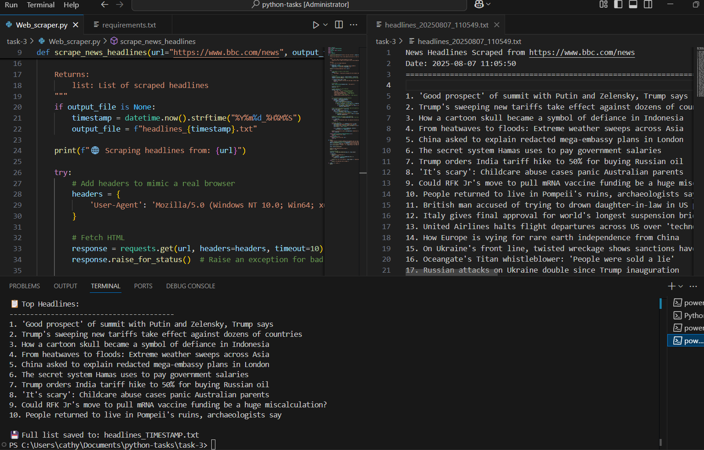

# Web Scraper for News Headlines

A Python-based web scraper that automatically extracts news headlines from news websites and saves them to text files.

## 🚀 Features

- **Multi-source support**: Works with BBC News, CNN, and other news websites
- **Robust extraction**: Uses multiple strategies to find headlines reliably
- **Error handling**: Handles network issues and website structure changes gracefully
- **Command-line interface**: Easy to use with configurable options
- **Clean output**: Saves headlines with timestamps and proper formatting
- **Duplicate removal**: Automatically filters out duplicate headlines

## 📋 Requirements

- Python 3.6+
- requests
- beautifulsoup4
- lxml

## 🔧 Installation

1. Clone the repository:
```bash
git clone https://github.com/cathyjenish/Web-Scraper-for-News-Headlines.git
cd Web-Scraper-for-News-Headlines
```

2. Install dependencies:
```bash
pip install -r requirements.txt
```

## 🎯 Usage

### Basic Usage
```bash
# Scrape headlines from BBC News (default)
python Web_scraper.py
```

### Advanced Usage
```bash
# Scrape from a specific news website
python Web_scraper.py --url "https://www.cnn.com"

# Save to a custom filename
python Web_scraper.py --output "headlines.txt"

# Combine options
python Web_scraper.py --url "https://www.reuters.com" --output "reuters_news.txt"
```

## 📊 Output Format

The scraper creates text files with the following format:
```
News Headlines Scraped from [URL]
Date: [Current Date/Time]
================================================================================

1. [Headline 1]
2. [Headline 2]
3. [Headline 3]
...
```

## 🛠️ Technical Details

### How It Works
1. **HTTP Request**: Uses `requests` library to fetch webpage content
2. **HTML Parsing**: Uses `BeautifulSoup` to parse HTML structure
3. **Headline Extraction**: Searches for headlines in:
   - `<h1>`, `<h2>`, `<h3>` tags
   - Common CSS classes (`.headline`, `.title`)
   - Website-specific selectors
4. **Data Cleaning**: Removes duplicates and filters out navigation text
5. **File Output**: Saves results to timestamped text files

### Error Handling
- Network timeout handling
- HTTP error recovery
- Graceful handling of website structure changes
- Informative error messages

## 🧪 Testing

The scraper has been tested with:
- ✅ BBC News (default)
- ✅ CNN
- ✅ Reuters
- ✅ Various other news websites

## 📈 Example Output



## 🤝 Contributing

Feel free to submit issues and enhancement requests!


